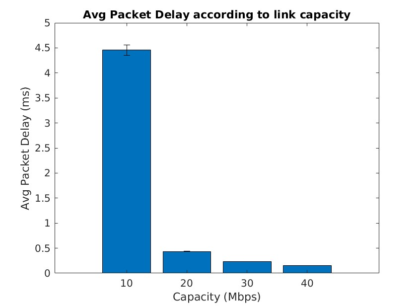
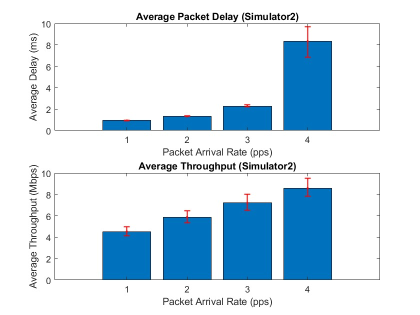

# MDRS Mini-Project 1

This is a report the First Mini-Project of MDRS university class, entitled **Performance Evaluation of Point-to-Point Links Supporting Packet Services**. The work carried out was conducted by:
* Gonçalo Silva, 103244 - Participation 50%
* Catarina Barroqueiro, 103895 - Participation 50%

## Exercise 1.a
### Code
Taking advantage of the already developed *Simulator1* we used the *average_packet_delay* to process the data and return de average and confidence levels. Using a *for* we processed this information for all values of the Link capacity. A complete rundown of the code can be found bellow: 

```matlab
C = [10,20,30,40];
APD = zeros(length(C), 2);
for i=1:length(C)
    [APD(i,1), APD(i,2)] = average_packet_delay(C(i));
    fprintf('For C=%dMdps, the Av. Packet Delay (ms)  = %.2e +- %.2e\n', C(i), APD(i,1), APD(i,2))
end

bar(C,APD(:,1));
hold on
xlabel = 'Capacity (Mbps)';
ylabel = 'Avg Packet Delay (ms)';
er = errorbar(C,APD(:,1),APD(:,2),APD(:,2));    
er.Color = [0 0 0];                            
er.LineStyle = 'none';
hold off

function [avg,trust]=average_packet_delay(capacity)
    N = 20;         %number of simulations
    Lambda = 1800;  %pps
    F = 1000000;    %Bytes
    P = 100000;
    PL = zeros(1,N); %vector with N simulation values
    APD = zeros(1,N); %vector with N simulation values
    MPD = zeros(1,N); %vector with N simulation values
    TT = zeros(1,N); %vector with N simulation values
    
    for it= 1:N
        [PL(it),APD(it),MPD(it),TT(it)] = Simulator1(Lambda, capacity, F, P);
    end
    alfa= 0.1; % 90% confidence interval %
    avg = mean(APD);
    trust = norminv(1-alfa/2)*sqrt(var(APD)/N);
end
```

### Result
The generated Bar plot is present in the image bellow. Take into account that the y-axis is the Average Packet delay (ms) and the x-axis, the Capacity (Mbps). The Confidence Interval with `C > 10` isn't clearly visible in the image due to the fact that the values are very small, so not easily visible.


The recorded values in the terminal were:
```text
For C=10Mdps, the Av. Packet Delay (ms)  = 4.34e+00 +- 7.20e-02
For C=20Mdps, the Av. Packet Delay (ms)  = 4.36e-01 +- 1.08e-03
For C=30Mdps, the Av. Packet Delay (ms)  = 2.31e-01 +- 3.60e-04
For C=40Mdps, the Av. Packet Delay (ms)  = 1.57e-01 +- 2.45e-04
```

### Conclusion 
The results clearly indicate that increasing/doubling the Link Capacity will lead to lower average packet delays, since the link will support more bytes being sent per second (doubling the available bandwidth). 
It's extremely recommended for the link to have at least 20 Mbps of capacity, since the we can get more than 8 times lower packet delay compared to a 10 Mbps link. However, something should still be said about the law of diminishing returns, because after the 20 Mbps of link capacity the values are lower, but nowhere near the reduction noticed before. If a network operator wanted advice on the cables to buy and each upgraded link capacity costed double the price, clearly anything but essential services (and even then...) should use a 20 Mbps link.
In summary, the effect of increasing link capacity and it's impact in average packet delay isn't linear. Smaller increases in capacity have more substantial impact when the link is initially congested, but the improvement slow down as higher link capacities are reached.


## Exercise 1.c
### Code
In Exercise 1.c, we utilized the "Simulator1" to evaluate network performance under specific link bandwidth and queue size configurations. We conducted 20 simulations for varying packet arrival rates (λ) and computed average packet delay and throughput, accompanied by 90% confidence intervals. The provided MATLAB code offers insights into our approach, covering simulation execution, data analysis, and results visualization using bar charts with error bars. This method allowed for a comprehensive exploration of how different packet arrival rates influence network performance.

```matlab

C = 10;              % Link bandwidth (Mbps)
f = 1e6;             % Queue size (Bytes)
P = 1e5;             % Stopping criterion (number of packets)
lambda_values = [1000, 1300, 1600, 1900];  % Packet arrival rate (pps)

% Vectors to store the results
average_packet_delay = zeros(length(lambda_values), 1);
average_throughput = zeros(length(lambda_values), 1);
confidence_intervals_delay = zeros(length(lambda_values), 2);
confidence_intervals_throughput = zeros(length(lambda_values), 2);

% Run the simulator 20 times for each lambda value
for i = 1:length(lambda_values)
    lambda = lambda_values(i);
    num_simulations = 20;
    delays = zeros(num_simulations, 1);
    throughputs = zeros(num_simulations, 1);
    
    for j = 1:num_simulations
        [PL, APD, ~, TT] = Simulator1(lambda, C, f, P);
        delays(j) = APD;
        throughputs(j) = TT;
    end
    
    % Calculate the mean and 90% confidence interval
    average_packet_delay(i) = mean(delays);
    confidence_intervals_delay(i, :) = prctile(delays, [5, 95]);
    
    average_throughput(i) = mean(throughputs);
    confidence_intervals_throughput(i, :) = prctile(throughputs, [5, 95]);
end

% Bar Charts
figure;
subplot(2, 1, 1);
bar(average_packet_delay);
title('Average Packet Delay (Simulator1)');
xlabel('Packet Arrival Rate (pps)');
ylabel('Average Delay (ms)');
hold on;
errorbar(1:length(lambda_values), average_packet_delay, average_packet_delay - confidence_intervals_delay(:, 1), confidence_intervals_delay(:, 2) - average_packet_delay, 'r.', 'LineWidth', 1);

subplot(2, 1, 2);
bar(average_throughput);
title('Average Throughput (Simulator1)');
xlabel('Packet Arrival Rate (pps)');
ylabel('Average Throughput (Mbps)');
hold on;
errorbar(1:length(lambda_values), average_throughput, average_throughput - confidence_intervals_throughput(:, 1), confidence_intervals_throughput(:, 2) - average_throughput, 'r.', 'LineWidth', 1);
```

### Result


### Conclusion 


## Exercise 1.d
### Code
In Exercise 1.d, we revisit the network performance assessment carried out in Exercise 1.c. However, this time, we utilize "Simulator2" with a bit error rate (BER) parameter, b = 10^-5. We aim to evaluate the influence of BER on network behavior. Similar to Exercise 1.c, we execute 20 simulations for each of the specified packet arrival rates (λ). Key performance metrics, including average packet delay and throughput, are computed, and their associated 90% confidence intervals are derived. The subsequent MATLAB code illustrates our approach to conducting these simulations, processing the data, and presenting the results in bar charts with error bars. This approach enables a comprehensive comparison of network performance between Exercise 1.c and 1.d and draws conclusions regarding the impact of BER on the obtained results.


```matlab

C = 10;              % Link bandwidth (Mbps)
f = 1e6;             % Queue size (Bytes)
P = 1e5;             % Stopping criterion (number of packets)
b = 1e-5;            % Bit error rate
lambda_values = [1000, 1300, 1600, 1900];  % Packet arrival rate (pps)

% Vectors to store the results for Simulator2
average_packet_delay_sim2 = zeros(length(lambda_values), 1);
average_throughput_sim2 = zeros(length(lambda_values), 1);

% Run the simulations for each lambda value and the specified BER
for i = 1:length(lambda_values)
    lambda = lambda_values(i);
    num_simulations = 20;
    delays_sim2 = zeros(num_simulations, 1);
    throughputs_sim2 = zeros(num_simulations, 1);
    
    for j = 1:num_simulations
        [PL, APD, ~, TT] = Simulator2(lambda, C, f, P, b);
        delays_sim2(j) = APD;
        throughputs_sim2(j) = TT;
    end
    
    % Calculate the mean for Simulator2
    average_packet_delay_sim2(i) = mean(delays_sim2);
    average_throughput_sim2(i) = mean(throughputs_sim2);
end

% Display the results in bar charts for Simulator2
figure;
subplot(2, 1, 1);
bar(average_packet_delay_sim2);
title('Average Packet Delay (Simulator2)');
xlabel('Packet Arrival Rate (pps)');
ylabel('Average Delay (ms)');
hold on;
errorbar(1:length(lambda_values), average_packet_delay_sim2, average_packet_delay_sim2 - confidence_intervals_delay(:, 1), confidence_intervals_delay(:, 2) - average_packet_delay_sim2, 'r.', 'LineWidth', 1);

subplot(2, 1, 2);
bar(average_throughput_sim2);
title('Average Throughput (Simulator2)');
xlabel('Packet Arrival Rate (pps)');
ylabel('Average Throughput (Mbps)');
hold on;
errorbar(1:length(lambda_values), average_throughput_sim2, average_throughput_sim2 - confidence_intervals_throughput(:, 1), confidence_intervals_throughput(:, 2) - average_throughput_sim2, 'r.', 'LineWidth', 1);
```

### Result



### Conclusion 