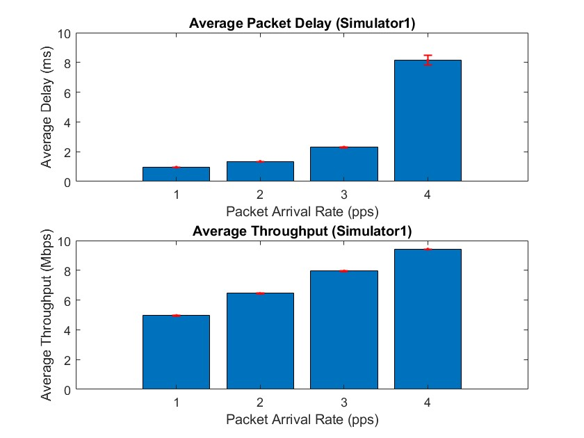
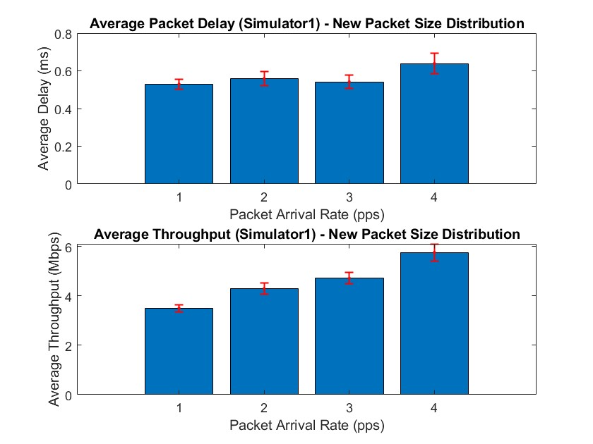
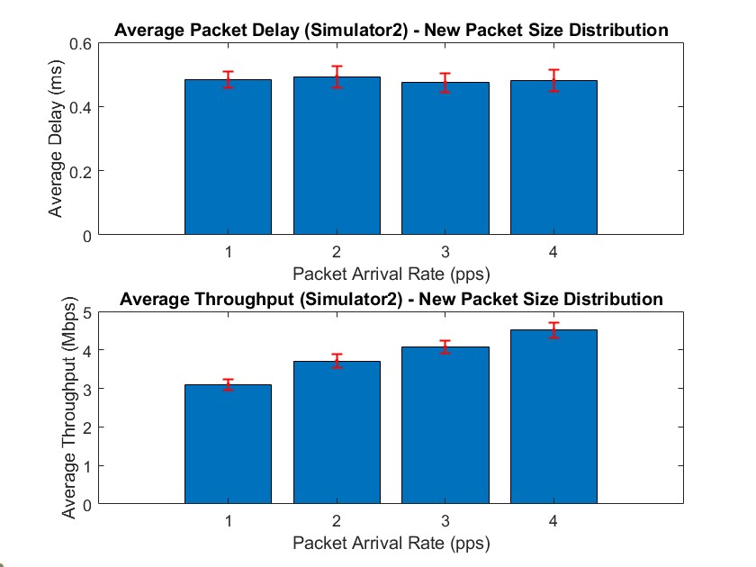
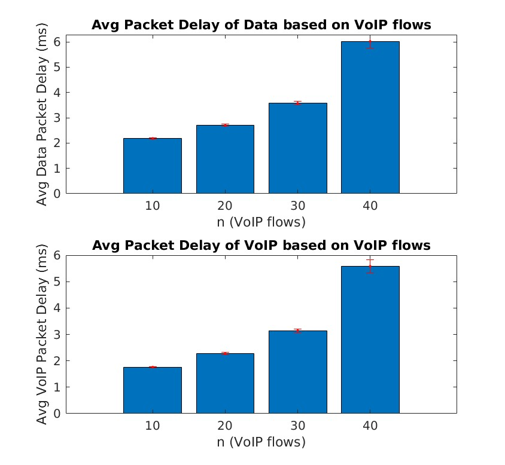
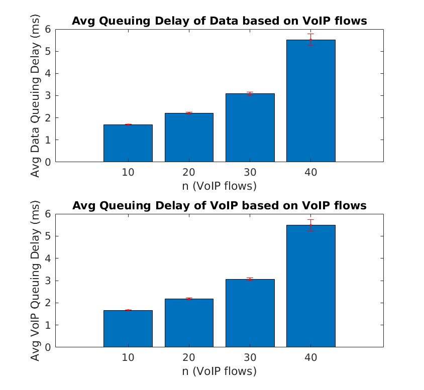

# MDRS Mini-Project 1

This is a report the First Mini-Project of MDRS university class, entitled **Performance Evaluation of Point-to-Point Links Supporting Packet Services**. The work carried out was conducted by:

* Gonçalo Silva, 103244 - Participation 50%
* Catarina Barroqueiro, 103895 - Participation 50%

## Exercise 1.a

### Code

Taking advantage of the already developed *Simulator1* we used the *average_packet_delay* to process the data and return de average and confidence levels. Using a *for* we processed this information for all values of the Link capacity. A complete rundown of the code can be found bellow:

```matlab
C = [10,20,30,40];
APD = zeros(length(C), 2);
for i=1:length(C)
    [APD(i,1), APD(i,2)] = average_packet_delay(C(i));
    fprintf('For C=%dMdps, the Av. Packet Delay (ms)  = %.2e +- %.2e\n', C(i), APD(i,1), APD(i,2))
end

bar(C,APD(:,1));
hold on
xlabel = 'Capacity (Mbps)';
ylabel = 'Avg Packet Delay (ms)';
er = errorbar(C,APD(:,1),APD(:,2),APD(:,2), 'r.');  
er.Color = [0 0 0];                  
er.LineStyle = 'none';
hold off

function [avg,trust]=average_packet_delay(capacity)
    N = 20;         %number of simulations
    Lambda = 1800;  %pps
    F = 1000000;    %Bytes
    P = 100000;
    PL = zeros(1,N); %vector with N simulation values
    APD = zeros(1,N); %vector with N simulation values
    MPD = zeros(1,N); %vector with N simulation values
    TT = zeros(1,N); %vector with N simulation values
  
    for it= 1:N
        [PL(it),APD(it),MPD(it),TT(it)] = Simulator1(Lambda, capacity, F, P);
    end
    alfa= 0.1; % 90% confidence interval %
    avg = mean(APD);
    trust = norminv(1-alfa/2)*sqrt(var(APD)/N);
end
```

### Result

The generated Bar plot is present in the image bellow. Take into account that the y-axis is the Average Packet delay (ms) and the x-axis, the Capacity (Mbps). The Confidence Interval with `C > 10` isn't clearly visible in the image due to the fact that the values are very small, so not easily visible.

<div style="text-align:center;">
  
</div>

The recorded values in the terminal were:

```text
For C=10Mdps, the Av. Packet Delay (ms)  = 4.46e+00 +- 1.01e-01
For C=20Mdps, the Av. Packet Delay (ms)  = 4.35e-01 +- 1.31e-03
For C=30Mdps, the Av. Packet Delay (ms)  = 2.31e-01 +- 4.41e-04
For C=40Mdps, the Av. Packet Delay (ms)  = 1.57e-01 +- 2.52e-04
```


### Conclusion

The results clearly indicate that increasing/doubling the Link Capacity will lead to lower average packet delays, since the link will support more bytes being sent per second (doubling the available bandwidth).
It's extremely recommended for the link to have at least 20 Mbps of capacity, since the we can get more than 8 times lower packet delay compared to a 10 Mbps link. However, something should still be said about the law of diminishing returns, because after the 20 Mbps of link capacity the values are lower, but nowhere near the reduction noticed before. If a network operator wanted advice on the cables to buy and each upgraded link capacity costed double the price, clearly anything but essential services (and even then...) should use a 20 Mbps link.
In summary, the effect of increasing link capacity and it's impact in average packet delay isn't linear. Smaller increases in capacity have more substantial impact when the link is initially congested, but the improvement slow down as higher link capacities are reached.

<div style="page-break-after: always"></div>

## Exercise 1.b

Before calculating the Average Packet delay for all link capacities, we need to introduces some formulas and values:

* The Mean Service time is calculated by the heavy average of packet size divided by the link capacity ($C$), with $S=packet\_size$ **in bytes** and $P=packet\_probability$ expressed $[0,1]$:
  $$
  E[S]=\sum_{i=1}^\infty\frac{ S_i }{C}\times P_i
  $$
* Second moment of the Service time (or Variance of the service time):
  $$
  E[S²]=\sum_{i=1}^\infty\frac{S_i²}{C}\times P_i
  $$
* The *Pollaczek-Khinchine* formula is used to calculate the average waiting time (WQ) **in an M/G/1 queue**:
  $$
  W_Q = \frac{\lambda E[S]}{2(1 - \lambda E[S])}
  $$
* With the *Pollaczek-Khinchine* formula we can calculate the average packet delay as:
  $$
  W = W_q + E[S]
  $$
* $\lambda = 1800$pps (Packets Per Second)

With this formulas in mind and with the help of Matlab, we'll proceed in calculating the Average Packet delay for each Capacity:

* For $C=10$:

$$
W_Q = \frac{\lambda E[S]}{2(1 - \lambda E[S])}
 = \frac{1800 \times 4.96 \times  10^{-4}}{2(1 - 1800 \times 4.96 \times  10^{-4})}
 = 3.8923 \text{ ms}
$$

$$
W = W_Q + E[S]
 = 3.8923 + 4.96 \times  10^{-4}
$$

$$
\equiv W = 4.3883 \text{ ms}
$$

* For $C=20$:

$$
W_Q = \frac{1800 \times 2.48 \times 10^{-4}}{2(1 - 1800 \times 2.48 \times 10^{-4})} = 0.1884 \text{ ms}
$$

$$
W = W_Q +E[S] = 0.1884 + 2.48 \times 10^{-4}
$$

$$
\equiv W = 0.4364 \text{ ms} = 4.364 \times 10^{-1} \text{ ms}
$$

* For $C=30$:

$$
W_Q = \frac{1800 \times 2.48 \times 10^{-4}}{2(1 - 1800 \times 2.48 \times 10^{-4})} = 0.0660 \text{ ms}
$$

$$
W = W_Q + E[S] = 0.1884 + 1.65 \times 10^{-4}
$$

$$
\equiv W = 0.2313 \text{ ms} = 2.313 \times 10^{-1} \text{ ms}
$$

* For $C=40$:

$$
W_Q = \frac{1800 \times 1.24 \times 10^{-4}}{2(1 - 1800 \times 1.24 \times 10^{-4})} = 0.0336 \text{ ms}
$$

$$
W = W_Q + E[S] = 0.0336 + 1.24 \times 10^{-4}
$$

$$
\equiv W =  0.1576 \text{ ms} = 1.576 \times 10^{-1} \text{ ms}
$$

### Conclusion:

Analyzing the resulting data indicates that as link capacity is increased, the Average Packet Transmission time is decreased, resulting in lower queueing delays ($W_q$) and Average Packet Delay ($W$). 
The theoretical results obtained are very similar with what was achieved on the Simulation performed in exercise 1.a. Although the Simulation uses a more real-world approach on obtaining the data, it comes at a cost of performance. The Theoretical approach using the **M/G/1 model** is processed almost instantly and since the obtained values are very close, we can use them when decision making, instead of always needing to simulate the use-cases.

### Matlab Script code and output

```matlab
C = [10,20,30,40]; % Mbps

for i=1:length(C)
    capacity = C(i)*10^6;
    fprintf('For C=%d:\n', C(i));
    prob_left = (1 - (0.19 + 0.23 + 0.17)) / ((109 - 65 + 1) + (1517 - 111 + 1));
    avg_bytes = 0.19*64 + 0.23*110 + 0.17*1518 + sum((65:109)*(prob_left)) + sum((111:1517)*(prob_left));
    avg_time = avg_bytes * 8 / capacity;
 
    fprintf("\tAverage packet size is: %.2f Bytes\n", avg_bytes);
    fprintf("\tAverage packet trasmission time is: %.2e seconds\n", avg_time);
    x = 64:1518;
    s = (x .* 8) ./ (capacity);
    s2 = (x .* 8) ./ (capacity);
    for i = 1:length(x)
        if i == 1
            s(i) = s(i) * 0.19;
            s2(i) = s2(i)^2 * 0.19;
        elseif i == 110-64+1
            s(i) = s(i) * 0.23;
            s2(i) = s2(i)^2 * 0.23;
        elseif i == 1518-64+1
            s(i) = s(i) * 0.17;
            s2(i) = s2(i)^2 * 0.17;
        else
            s(i) = s(i) * prob_left;
            s2(i) = s2(i)^2 * prob_left;
        end
    end
  
    Es = sum(s);
    Es2 = sum(s2);

    fprintf('\tE[S] = %.2e seconds\n', Es);
    fprintf('\tE[S2] = %.2e seconds\n', Es2);
  
    Wq = (K * Es2) / (2 * (1 - K * Es));
    W = Wq + Es;% W = Wq + E[s]
    fprintf('\tWq = %.4f ms\n', Wq*1000);
    fprintf('\tW = %.4f ms\n', W*1000);

end
```

The script originated the following terminal output:

```text
For C=10:
	Average packet size is: 620.02 Bytes
	Average packet trasmission time is: 4.96e-04 seconds
	E[S] = 4.96e-04 seconds
	E[S2] = 4.63e-07 seconds
	Wq = 3.8923 ms
	W = 4.3883 ms
For C=20:
	Average packet size is: 620.02 Bytes
	Average packet trasmission time is: 2.48e-04 seconds
	E[S] = 2.48e-04 seconds
	E[S2] = 1.16e-07 seconds
	Wq = 0.1884 ms
	W = 0.4364 ms
For C=30:
	Average packet size is: 620.02 Bytes
	Average packet trasmission time is: 1.65e-04 seconds
	E[S] = 1.65e-04 seconds
	E[S2] = 5.15e-08 seconds
	Wq = 0.0660 ms
	W = 0.2313 ms
For C=40:
	Average packet size is: 620.02 Bytes
	Average packet trasmission time is: 1.24e-04 seconds
	E[S] = 1.24e-04 seconds
	E[S2] = 2.90e-08 seconds
	Wq = 0.0336 ms
	W = 0.1576 ms

```

<div style="page-break-after: always"></div>

## Exercise 1.c

### Code

In Exercise 1.c, we utilized the "Simulator1" to evaluate network performance under specific link bandwidth and queue size configurations. We conducted 20 simulations for varying packet arrival rates (λ) and computed average packet delay and throughput, accompanied by 90% confidence intervals. The provided MATLAB code offers insights into our approach, covering simulation execution, data analysis, and results visualization using bar charts with error bars. This method allowed for a comprehensive exploration of how different packet arrival rates influence network performance.

```matlab
C = 10;              % Link bandwidth (Mbps)
f = 1e6;             % Queue size (Bytes)
P = 1e5;             % Stopping criterion (number of packets)
lambda_values = [1000, 1300, 1600, 1900];  % Packet arrival rate (pps)

N = 20; % Number of simulations

% Vectors to store the results
average_packet_delay = zeros(length(lambda_values), 1);
average_throughput = zeros(length(lambda_values), 1);
confidence_intervals_delay = zeros(length(lambda_values), 2);
confidence_intervals_throughput = zeros(length(lambda_values), 2);

for i = 1:length(lambda_values)
    lambda = lambda_values(i);
    
    % Create vectors to store results of simulations
    delays = zeros(N, 1);
    throughputs = zeros(N, 1);
    
    for j = 1:N
        [PL, APD, ~, TT] = Simulator1(lambda, C, f, P);
        delays(j) = APD;
        throughputs(j) = TT;
    end
    
    % Calculate the mean and confidence interval for delay
    media = mean(delays);
    term = norminv(0.95) * sqrt(var(delays) / N);
    fprintf('Average Packet Delay for lambda = %d: %.2f +- %.2f\n', lambda, media, term);
    
    average_packet_delay(i) = media;
    confidence_intervals_delay(i, :) = [media - term, media + term];
    
    % Calculate the mean and confidence interval for throughput
    media = mean(throughputs);
    term = norminv(0.95) * sqrt(var(throughputs) / N);
    fprintf('Average Throughput for lambda = %d: %.2f +- %.2f\n', lambda, media, term);
    
    average_throughput(i) = media;
    confidence_intervals_throughput(i, :) = [media - term, media + term];
end

% Bar Charts
figure;
subplot(2, 1, 1);
bar(average_packet_delay);
title('Average Packet Delay (Simulator1)');
xlabel('Packet Arrival Rate (pps)');
ylabel('Average Delay (ms)');
hold on;
errorbar(1:length(lambda_values), average_packet_delay, average_packet_delay - confidence_intervals_delay(:, 1), confidence_intervals_delay(:, 2) - average_packet_delay, 'r.', 'LineWidth', 1);

subplot(2, 1, 2);
bar(average_throughput);
title('Average Throughput (Simulator1)');
xlabel('Packet Arrival Rate (pps)');
ylabel('Average Throughput (Mbps)');
hold on;
errorbar(1:length(lambda_values), average_throughput, average_throughput - confidence_intervals_throughput(:, 1), confidence_intervals_throughput(:, 2) - average_throughput, 'r.', 'LineWidth', 1);

```


### Result

The script originated the following terminal output:

```text
Average Packet Delay for lambda = 1000: 0.96 +- 0.00
Average Throughput for lambda = 1000: 4.96 +- 0.01
Average Packet Delay for lambda = 1300: 1.34 +- 0.01
Average Throughput for lambda = 1300: 6.44 +- 0.01
Average Packet Delay for lambda = 1600: 2.27 +- 0.02
Average Throughput for lambda = 1600: 7.93 +- 0.01
Average Packet Delay for lambda = 1900: 8.06 +- 0.29
Average Throughput for lambda = 1900: 9.43 +- 0.02
```

<div style="text-align:center;">
  
</div>

### Conclusion

The experiment evaluated the performance of a communication system with specific settings (C = 10 Mbps and f = 1,000,000 Bytes) while varying the packet arrival rate (λ) from 1000 to 1900 pps (packets per second). Key findings include average packet delay and average throughput.

#### Average Packet Delay
- For λ = 1000 pps, the average packet delay was 0.96 with a small margin of error, indicating minimal delay.
- As the packet arrival rate increased, the average delay also increased, reaching 2.27 for λ = 1600 pps.
- However, at λ = 1900 pps, the delay significantly jumped to 8.06 with a wide margin of error, suggesting substantial delays at high arrival rates.

#### Average Throughput
- For λ = 1000 pps, the average throughput was 4.96 Mbps, with a small margin of error, indicating efficient bandwidth utilization.
- As the packet arrival rate increased, the average throughput initially rose to 7.93 Mbps for λ = 1600 pps.
- However, at λ = 1900 pps, the throughput dropped to 9.43 Mbps, suggesting system saturation.


The packet arrival rate (λ) has a substantial impact on the performance of the communication system. As λ increases, it results in higher average packet delay, although there is an initial boost in throughput. At moderate arrival rates (λ = 1000 to 1600 pps), the system operates efficiently, demonstrating low delay and high throughput. However, at very high arrival rates (λ = 1900 pps), the system encounters significant delays and reaches its throughput limit, indicating saturation. Consequently, optimizing the packet arrival rate becomes crucial to strike a delicate balance between bandwidth efficiency and service quality in communication systems.


<div style="page-break-after: always"></div>

## Exercise 1.d

### Code

In Exercise 1.d, we revisit the network performance assessment carried out in Exercise 1.c. However, this time, we utilize "Simulator2" with a bit error rate (BER) parameter, b = 10^-5. We aim to evaluate the influence of BER on network behavior. Similar to Exercise 1.c, we execute 20 simulations for each of the specified packet arrival rates (λ). Key performance metrics, including average packet delay and throughput, are computed, and their associated 90% confidence intervals are derived. The subsequent MATLAB code illustrates our approach to conducting these simulations, processing the data, and presenting the results in bar charts with error bars. This approach enables a comprehensive comparison of network performance between Exercise 1.c and 1.d and draws conclusions regarding the impact of BER on the obtained results.

```matlab
C = 10;              % Link bandwidth (Mbps)
f = 1e6;             % Queue size (Bytes)
P = 1e5;             % Stopping criterion (number of packets)
b = 1e-5;            % Bit error rate
lambda_values = [1000, 1300, 1600, 1900];  % Packet arrival rate (pps)

N = 20; % Number of simulations

% Vectors to store the results for Simulator2
average_packet_delay_sim2 = zeros(length(lambda_values), 1);
average_throughput_sim2 = zeros(length(lambda_values), 1);
confidence_intervals_delay_sim2 = zeros(length(lambda_values), 2);
confidence_intervals_throughput_sim2 = zeros(length(lambda_values), 2);

for i = 1:length(lambda_values)
    lambda = lambda_values(i);
    
    % Create vectors to store results of simulations for Simulator2
    delays_sim2 = zeros(N, 1);
    throughputs_sim2 = zeros(N, 1);
    
    for j = 1:N
        [PL, APD, ~, TT] = Simulator2(lambda, C, f, P, b);
        delays_sim2(j) = APD;
        throughputs_sim2(j) = TT;
    end
    
    % Calculate the mean and confidence interval for delay for Simulator2
    media = mean(delays_sim2);
    term = norminv(0.95) * sqrt(var(delays_sim2) / N);
    fprintf('Average Packet Delay for Simulator2 with lambda = %d: %.2f +- %.2f\n', lambda, media, term);
    
    average_packet_delay_sim2(i) = media;
    confidence_intervals_delay_sim2(i, :) = [media - term, media + term];
    
    % Calculate the mean and confidence interval for throughput for Simulator2
    media = mean(throughputs_sim2);
    term = norminv(0.95) * sqrt(var(throughputs_sim2) / N);
    fprintf('Average Throughput for Simulator2 with lambda = %d: %.2f +- %.2f\n', lambda, media, term);
    
    average_throughput_sim2(i) = media;
    confidence_intervals_throughput_sim2(i, :) = [media - term, media + term];
end

% Display the results in bar charts for Simulator2
figure;
subplot(2, 1, 1);
bar(average_packet_delay_sim2);
title('Average Packet Delay (Simulator2)');
xlabel('Packet Arrival Rate (pps)');
ylabel('Average Delay (ms)');
hold on;
errorbar(1:length(lambda_values), average_packet_delay_sim2, average_packet_delay_sim2 - confidence_intervals_delay_sim2(:, 1), confidence_intervals_delay_sim2(:, 2) - average_packet_delay_sim2, 'r.', 'LineWidth', 1);

subplot(2, 1, 2);
bar(average_throughput_sim2);
title('Average Throughput (Simulator2)');
xlabel('Packet Arrival Rate (pps)');
ylabel('Average Throughput (Mbps)');
hold on;
errorbar(1:length(lambda_values), average_throughput_sim2, average_throughput_sim2 - confidence_intervals_throughput_sim2(:, 1), confidence_intervals_throughput_sim2(:, 2) - average_throughput_sim2, 'r.', 'LineWidth', 1);
```

### Result

The script originated the following terminal output:

```text
Average Packet Delay for Simulator2 with lambda = 1000: 0.94 +- 0.00
Average Throughput for Simulator2 with lambda = 1000: 4.53 +- 0.01
Average Packet Delay for Simulator2 with lambda = 1300: 1.33 +- 0.01
Average Throughput for Simulator2 with lambda = 1300: 5.89 +- 0.01
Average Packet Delay for Simulator2 with lambda = 1600: 2.29 +- 0.03
Average Throughput for Simulator2 with lambda = 1600: 7.24 +- 0.01
Average Packet Delay for Simulator2 with lambda = 1900: 8.08 +- 0.24
Average Throughput for Simulator2 with lambda = 1900: 8.58 +- 0.01
```

<div style="text-align:center;">
  
</div>

<div style="page-break-after: always"></div>

### Conclusion
In experiment 1.d, the focus was on investigating the impact of Bit Error Rate (BER) on the performance of the communication system, and it was performed using Simulator2 with a specified BER (b = 10^-5). Here's a comparison with the results from experiment 1.c:

#### Average Packet Delay
- For λ = 1000 pps in Simulator2, the average packet delay was 0.94 with a small margin of error. In comparison, the average packet delay for the same λ in Simulator1 was 0.96 with a similar margin of error. The delay values are quite close, suggesting that a relatively low BER does not significantly affect packet delay.

- As the packet arrival rate increased to λ = 1300 pps, both Simulator2 and Simulator1 showed an increase in average packet delay (1.33 and 1.34, respectively). Again, the difference is minimal, indicating that BER did not have a substantial impact on the delay for these moderate arrival rates.

- However, for λ = 1600 pps, Simulator2 exhibited a slightly higher average packet delay (2.29) compared to Simulator1 (2.27). The margin of error was also slightly larger for Simulator2. This suggests that as the packet arrival rate increases, a higher BER may result in slightly more delay.
At the highest tested rate, λ = 1900 pps, Simulator2 showed a similar average packet delay (8.08) compared to Simulator1 (8.06). Both had wide margins of error, indicating significant delays at this high arrival rate.

#### Average Throughput

- For λ = 1000 pps in Simulator2, the average throughput was 4.53 Mbps, while in Simulator1, it was 4.96 Mbps. The lower throughput in Simulator2 is expected, as a higher BER (10^-5) results in more packet loss and retransmissions.
As λ increased to 1300 pps, Simulator2 maintained a lower throughput (5.89 Mbps) compared to Simulator1 (6.44 Mbps), reflecting the impact of BER on throughput.

- At λ = 1600 pps, Simulator2 still had lower throughput (7.24 Mbps) compared to Simulator1 (7.93 Mbps).

- At λ = 1900 pps, Simulator2's throughput (8.58 Mbps) surpassed that of Simulator1 (9.43 Mbps), suggesting that at very high arrival rates, the lower BER in Simulator2 mitigated some of the effects of congestion.


**The Bit Error Rate (BER) plays a significant role in determining the performance of a communication system, especially in scenarios with higher packet loss.**

At moderate arrival rates (λ = 1000 to 1600 pps), the differences in average packet delay between Simulator1 and Simulator2 were minimal. This suggests that **a moderate BER does not strongly impact delay at these rates.**

However, as the packet arrival rate increases, the impact of BER becomes more pronounced. In Simulator2, with **a lower BER, the average packet delay tends to be slightly higher at high arrival rates.**

**The impact of BER on throughput is more evident.** Simulator2 consistently showed lower throughput than Simulator1, especially at moderate and high arrival rates. This is due to the increased packet loss and retransmissions caused by **a higher BER.**

For very high arrival rates, **the lower BER in Simulator2 led to slightly better throughput compared to Simulator1, indicating that a lower BER can mitigate congestion effects to some extent.**
In summary, these results emphasize the importance of considering BER when designing and evaluating communication systems, particularly in scenarios with high packet loss and congestion. **Lower BER can lead to improved performance in such situations, but it may have limited benefits at moderate arrival rates.**


## Exercise 1.e

### Code

Considering the same packet size as present in the Simulators, just the new probabilities, we just needed to modify the *GeneratePacketSize* function in both the simulators.

```matlab
function out= GeneratePacketSize()
    aux= rand();
    aux2= [65:109 111:1517];
    if aux <= 0.25
        out= 64;
    elseif aux <= 0.25 + 0.17
        out= 110;
    elseif aux <= 0.25 + 0.17 + 0.11
        out= 1518;
    else
        out = aux2(randi(length(aux2)));
    end
end
```

### Result

<div style="text-align:center;">
  
</div>

<div style="text-align:center;">
  
</div>

### Conclusion

<div style="page-break-after: always"></div>

## Exercise 2.a

### Modifications or insertions in the code
In order to obtain the Average Packet Queuing Delay, some changes needed to be made to Simulator3, mainly the introduction of four new variables:
* `TotalQueuingDelayData` - Holds the Queuing times of all **data** packets
* `TotalQueuingDelayVoip` - Holds the Queuing times of all **voip** packets
* `AQDdata` - Calculates the Average Queuing Delay of **data** packets, by the ratio of Queuing times with the total transmitted **data** packets.
* `AQDvoip` - Calculates the Average Queuing Delay of **voip** packets, by the ratio of Queuing times with the total transmitted **voip** packets.
This changes involved incrementing the variables of Queuing times, when the packet are **Departing**, and a check to not count the last packet, as it may not be received, so shouldn't be counted (with higher thresholds won't make a difference, but in lower it'll affect the results). This changes can be observed in the following code:
```matlab
function [PLdata, PLvoip , APDdata, APDvoip , AQDdata, AQDvoip, MPDdata, MPDvoip , TT] = Simulator3(lambda,C,f,P,n)
(...)
MAXDELAYvoip= 0;           % Maximum delay among all transmitted voip packets
TotalQueuingDelayData= 0;
TotalQueuingDelayVoip= 0;

% Initializing the simulation clock:
Clock= 0;
(...)

while (TRANSMITTEDPACKETSdata+TRANSMITTEDPACKETSvoip)<P               % Stopping criterium
    (...)               % Eliminate first event
    if Event == ARRIVAL         % If first event is an ARRIVAL
        (...)
    else                        % If first event is a DEPARTURE
        (...)
        
        if QUEUEOCCUPATION > 0
            Event_List = [Event_List; DEPARTURE, Clock + 8*QUEUE(1,1)/(C*10^6), QUEUE(1,1), QUEUE(1,2), QUEUE(1,3)];
            QUEUEOCCUPATION= QUEUEOCCUPATION - QUEUE(1,1);
            if (TRANSMITTEDPACKETSdata+TRANSMITTEDPACKETSvoip)<P
                if QUEUE(1,3) == VOIP 
                    TotalQueuingDelayVoip = TotalQueuingDelayVoip + (Clock - QUEUE(1,2));
                else
                    TotalQueuingDelayData = TotalQueuingDelayData + (Clock - QUEUE(1,2));
                end
            end
            
            QUEUE(1,:)= [];
        else
            STATE= 0;
        end
    end
end

(...)
APDvoip= 1000*DELAYSvoip/TRANSMITTEDPACKETSvoip;   % in milliseconds
AQDdata= 1000*TotalQueuingDelayData/TRANSMITTEDPACKETSdata;   % in milliseconds
AQDvoip= 1000*TotalQueuingDelayVoip/TRANSMITTEDPACKETSvoip;   % in milliseconds
MPDdata= 1000*MAXDELAYdata;                    % in milliseconds
(...)
```
In the script to launch the Simulator, we just want to point out the function that accepts the modifiable n VoIP flow numbers and calculates all the necessary attributes:
```matlab
function [(avg_data,trust_data, avg_voip, trust_voip, avg_queue_data, trust_queue_data, avg_queue_voip, trust_queue_voip)]=average_packet_delay(n)
    Iter = 20;         %number of simulations
    Lambda = 1500;  %pps
    F = 1000000;    %Bytes
    P = 100000;
    C = 10;
    APDdata = zeros(1,Iter); %vector with N simulation values
    APDvoip = zeros(1,Iter); %vector with N simulation values
    AQDdata = zeros(1,Iter); %vector with N simulation values
    AQDvoip = zeros(1,Iter); %vector with N simulation values
      
    for it= 1:Iter
        [~,~,APDdata(it),APDvoip(it),AQDdata(it),AQDvoip(it),~,~,~] = Simulator3(Lambda, C, F, P, n);
    end
    alfa= 0.1; % 90% confidence interval %
    avg_data = mean(APDdata);
    trust_data = norminv(1-alfa/2)*sqrt(var(APDdata)/Iter);
    avg_voip = mean(APDvoip);
    trust_voip = norminv(1-alfa/2)*sqrt(var(APDvoip)/Iter);
    avg_queue_data = mean(AQDdata);
    trust_queue_data = norminv(1-alfa/2)*sqrt(var(AQDdata)/Iter);
    avg_queue_voip = mean(AQDvoip);
    trust_queue_voip = norminv(1-alfa/2)*sqrt(var(AQDvoip)/Iter);
end
```
### Result

Executing the matlab script resulted the following terminal output and images.
```text
For n=10:
	VoIP flows, the APD of data (ms)  = 2.18e+00 +- 2.60e-02
	VoIP flows, the APD of VoIP (ms)  = 1.76e+00 +- 2.33e-02
	VoIP flows, the AQD of data (ms)  = 1.69e+00 +- 2.57e-02
	VoIP flows, the AQD of VoIP (ms)  = 1.67e+00 +- 2.33e-02
For n=20:
	VoIP flows, the APD of data (ms)  = 2.70e+00 +- 4.46e-02
	VoIP flows, the APD of VoIP (ms)  = 2.27e+00 +- 4.15e-02
	VoIP flows, the AQD of data (ms)  = 2.20e+00 +- 4.42e-02
	VoIP flows, the AQD of VoIP (ms)  = 2.18e+00 +- 4.15e-02
For n=30:
	VoIP flows, the APD of data (ms)  = 3.58e+00 +- 7.10e-02
	VoIP flows, the APD of VoIP (ms)  = 3.14e+00 +- 6.82e-02
	VoIP flows, the AQD of data (ms)  = 3.08e+00 +- 7.07e-02
	VoIP flows, the AQD of VoIP (ms)  = 3.05e+00 +- 6.82e-02
For n=40:
	VoIP flows, the APD of data (ms)  = 6.02e+00 +- 2.64e-01
	VoIP flows, the APD of VoIP (ms)  = 5.58e+00 +- 2.59e-01
	VoIP flows, the AQD of data (ms)  = 5.52e+00 +- 2.64e-01
	VoIP flows, the AQD of VoIP (ms)  = 5.49e+00 +- 2.59e-01
```


<div style="text-align:center;">
  
</div>

<div style="text-align:center;">
  
</div>

As we can see by the terminal output and the images, Both **Average Packet Delay** and **Average Queuing Delay** show an increase in time, as the number of VoIP flows increases. This is due to the higher traffic generated by the increasing VoIP flows, competing for more resources of a limited bandwidth/link capacity. Since Simulator 3 doesn't implement priorities with the Data and VoIP packets, both types of packets have the same treatment in the FIFO queue. Which means that as observed in the images, the delays are similar for both of them.
This results indicate the need to establish priorities in the FIFO queue, since generally the VoIP should have lower delays than other packet types, given the higher time-sensitivity of the data. This same situation will be approached in the following exercise.

<div style="page-break-after: always"></div>

## Exercise 2.b

### Modifications or insertions in the code

THe changes needed for the new metrics have already been documented in exercise 2.a, with them just being altered in Simulator 4 and the new script calling the Simulator 4 instead of the 3.

### Result

Executing the matlab script resulted the following terminal output and images.
```text
For n=10:
	VoIP flows, the APD of data (ms)  = 2.18e+00 +- 2.60e-02
	VoIP flows, the APD of VoIP (ms)  = 1.76e+00 +- 2.33e-02
	VoIP flows, the AQD of data (ms)  = 1.69e+00 +- 2.57e-02
	VoIP flows, the AQD of VoIP (ms)  = 1.67e+00 +- 2.33e-02
For n=10:
	VoIP flows, the APD of data (ms)  = 2.27e+00 +- 2.44e-02
	VoIP flows, the APD of VoIP (ms)  = 4.62e-01 +- 1.21e-03
	VoIP flows, the AQD of data (ms)  = 1.78e+00 +- 2.41e-02
	VoIP flows, the AQD of VoIP (ms)  = 3.66e-01 +- 1.21e-03
For n=20:
	VoIP flows, the APD of data (ms)  = 2.89e+00 +- 4.19e-02
	VoIP flows, the APD of VoIP (ms)  = 4.84e-01 +- 1.27e-03
	VoIP flows, the AQD of data (ms)  = 2.39e+00 +- 4.16e-02
	VoIP flows, the AQD of VoIP (ms)  = 3.88e-01 +- 1.27e-03
For n=30:
	VoIP flows, the APD of data (ms)  = 4.06e+00 +- 8.08e-02
	VoIP flows, the APD of VoIP (ms)  = 5.08e-01 +- 1.45e-03
	VoIP flows, the AQD of data (ms)  = 3.56e+00 +- 8.05e-02
	VoIP flows, the AQD of VoIP (ms)  = 4.12e-01 +- 1.45e-03
For n=40:
	VoIP flows, the APD of data (ms)  = 7.11e+00 +- 2.15e-01
	VoIP flows, the APD of VoIP (ms)  = 5.35e-01 +- 1.26e-03
	VoIP flows, the AQD of data (ms)  = 6.62e+00 +- 2.15e-01
	VoIP flows, the AQD of VoIP (ms)  = 4.39e-01 +- 1.26e-03
```


<div style="text-align:center;">
  
</div>

<div style="text-align:center;">
  
</div>

As we can see by the terminal output and the images, the Simulator 4 with the introduction of priority for **VoIP** over **data** packets clearly improves the **Average Packet Delay** (APD) and **Average Queuing Delay** (AQD) of VoIP packets. This results in improvements ranging from 80 to 93% for the Queuing of **VoIP** packets, compared to a solution without priority. Also interesting is the stability of the system, independently of the number of VoIP flows, to maintain constant APD and AQD delays for **VoIP**.
However, the most interesting fact was that using priority for VoIP packets didn't result in a noticeable increase of APD and AQD for **data** packets, compared to a solution without priorities, showing that the overall impact in the system is minimal.
Concluding, using priorities for certain packet types (VoIP, real-time trading, emergency services), has a significant impact on reducing the delays for those systems, even under increased network load, but doesn't impact the other services as to cancel all the previous gains. This fact shows why this types of approaches are so widely used around the world in guaranteeing Quality of Service (QoS).